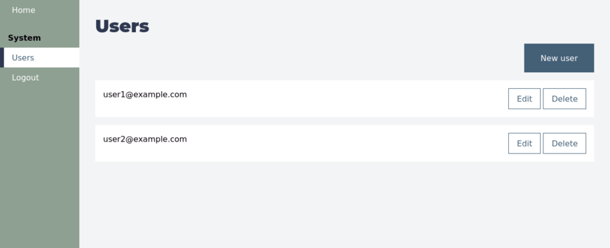

# Metus

Metus is a highly opinionated business application framework, made to create backend applications.



## Installation

Add this line to your application's Gemfile:

```ruby
gem 'metus'
```

And then execute:

```bash
$ bundle
```

Add the following to your `config/routes.rb`:

```
mount Metus::Engine, at: '/metus'
```

## Usage

### Backend Setup

To redirect to the backend's homepage after login, add the following to your `config/routes.rb`:

```ruby
  get :admin_root, to: redirect('/metus/backend/welcome'), status: 302, as: :admin_root
```

### Pages

Public, static pages are served by `Metus::PagesController`. Create the directory `app/views/pages` and create HAML templates (`.html.haml`) or Asciidoctor files (`.adoc`) there. For example, create `app/views/pages/home.html.haml`. Metus generates routes for you. To set your homepage to render `home.html.haml`, use the following route in your `config/routes.rb`:

```ruby
root to: 'metus/pages#home'
```

Pages are meant to be accessed without authentication. If your `ApplicationController` requires authentication, create a new controller which skips that authentication and tell Metus the name of that controller in `config/initializers/metus.rb`:

```ruby
Metus.public_controller_class = 'MyPublicController'
```

Asciidoctor pages are rendered within a `div` with the class `.asciidoc`, so that specific CSS styling can be applied.

### Navigation Links

Use the following for navigation links:

```ruby
nav_link_to 'My link title', blog_index_path, :exact, class: 'nav link'
nav_link_to 'My link title', blog_index_path, :controller, class: 'nav link'
```

When the current path equals the link, an `active` class is added to the link. When using `:exact` as an argument, the full path needs to match. When using `:controller`, only the controller needs to match, so the navigation link is `active` for any action within that controller.

### Production

Precompile assets using:

```bash
RAILS_ENV=production bin/rails metus:webpacker:compile
```

## Contributing

Contributions are welcome. Please open an issue on Github to discuss a contribution or open a pull request if you are feeling lucky.

### Development

Run the included test application:

```bash
bin/webpack-dev-server &
cd test/dummy
bin/rails s
```

## License

The gem is available as open source under the terms of the [MIT License](https://opensource.org/licenses/MIT).
